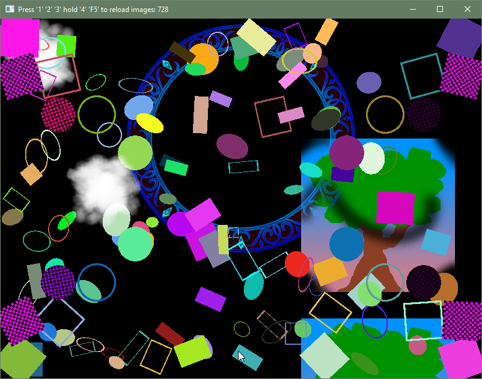

<h1>Granseal Engine</h1>

An prototype 2d game engine written in Rust and Wgsl for my learning and amusement.

<b>Status:</b> Pile of random code. Prototype maybe? Experiment.

<b>Version:</b> What's a version...

<h3>Design Goals</h3>
<ul>
<li>Simple to use and understand</li>
<li>Keep the complicated bits on the engine side</li>
<li>Sensible defaults, but able to change things as desired</li>
<li>To someday have tests and proper error  handling</li>
<li>Builder pattern is nice</li>
<li>Having goals</li>
</ul>
<h3>Features</h3>
<ul>
<li>Drawing colored or textured rectangles and ovals with or without an outline.</li>
</ul>
<h3>Todo</h3>
<ul>
<li>Drawing lines</li>
<li>Rotation</li>
<li>Textured shapes</li>
<li>Drawing Text</li>
<li>UI Elements</li>
<li>Playing Sounds</li>
<li>Everything</li>
</ul>